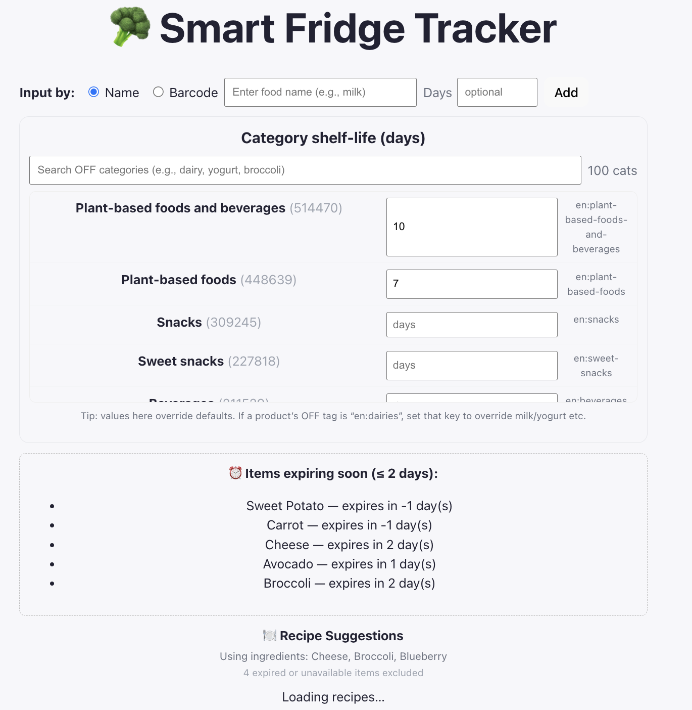
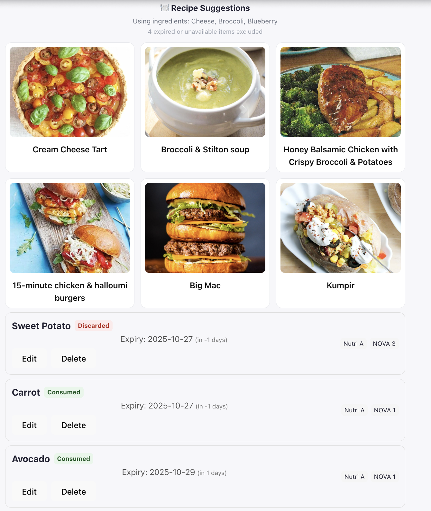
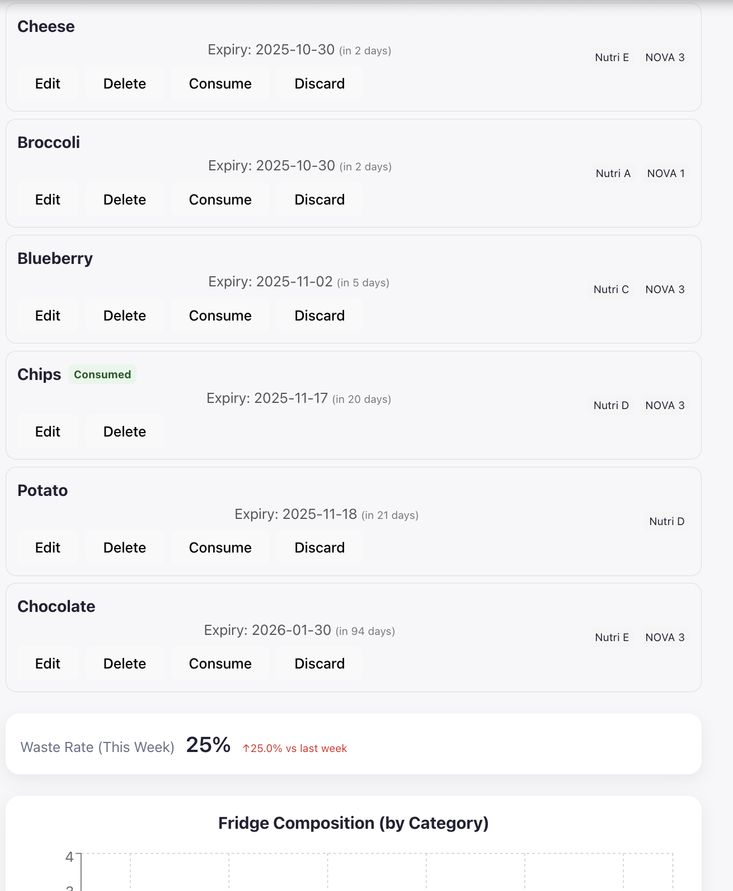
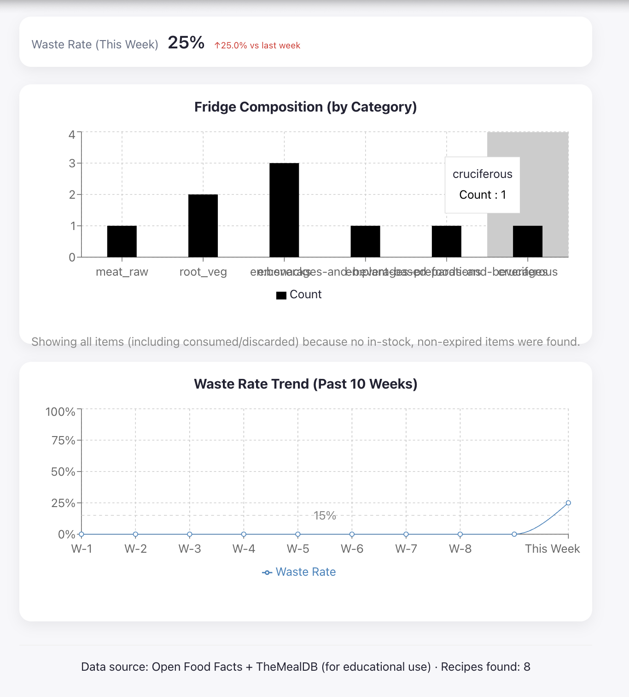

# Smart Fridge Tracker

## Problem Statement
    When I first came to the U.S. in high school, I noticed that my host family threw away almost half of their weekly groceries — about $80 worth of food — every week. I was confused at first, but later, when I started living on my own in college, I realized I had the **same problem**. I often forget what’s inside my fridge and end up wasting food. I need a quick way to check what’s about to expire and what I can cook with the ingredients I already have.

## Solution
   A React web app of smart feidge tracker can tracks items with shelf-life, highlights upcoming expirations, and visualizes waste trends and fridge composition. It also suggests recipes based on current ingredients. This may reduce the above problem in a large extent.

## API Used
    ### 🥕 Open Food Facts
        * Purpose: Fetch product metadata including category, NOVA group, and NutriScore.
        * Docs: [https://world.openfoodfacts.org/data](https://world.openfoodfacts.org/data)
        * Usage: Enriches user-entered food names with real nutrition and processing data.
    ### 🍳 TheMealDB
        * Purpose: Suggest recipes based on available ingredients.
        * Docs: [https://www.themealdb.com/api.php](https://www.themealdb.com/api.php)
        * Usage: Fetches and counts recipes that can be made from the fridge’s ingredients.

## Features
    1) Add items by name (or barcode) with optional shelf-life override
    2）Shelf-life tracking: Each item has an expiry date and optional override days, allowing users to monitor freshness at a glance.
    3）Expiration alerts: Items nearing expiry appear in a dedicated “Expiring Soon” panel to reduce waste.
    4）Nutritional value & processing levels: Using data from Open Food Facts, each item displays its NutriScore (nutritional quality) and NOVA group (degree of processing).
    5）Recipe recommendations: By fetching from TheMealDB, the app suggests recipes that can be made from current ingredients, connecting leftover management to practical meal ideas.
    6）Waste analytics: The app records consumption and discard events, then visualizes weekly waste rate trends to raise awareness of food habits.
    7）Fridge composition visualization: Users can see what types of food occupy their fridge (e.g., dairy, snacks, produce) in a clear bar chart.

## Setup Instructions

1. Clone this repository
2. Run `npm install`
3. (Optional) Create a `.env` file and configure any API keys if needed
4. Start the app:

   ```bash
   npm start       # for port 3000
   # or
   npm run dev     # default Vite port 5173
   ```
5. Open http://localhost:5173 
---

## AI Assistance
In this project 7, I used ChatGPT (GPT-5) to help structure and refine my project.
    ### Building the web app architecture:
    I learned how to structure a complete React web app using functional components, hooks, and modular organization. With ChatGPT’s help, I quickly set up the core framework — including item state management, API call logic, and local persistence through localStorage. It also guided me in building reusable components like AddItemBar, ExpiringPanel, and FridgeList, and in creating a clear data flow between them.

    ### Refining logic and debugging tricky edge cases:
    While the initial framework came together quickly, polishing the details took a lot of time. For example, I spent quite a while fixing state updates when editing or deleting items, clarifying how item names and expiration dates should be defined, and making sure the “days until expiry” calculation stayed consistent. I also tested how all these features interacted to make sure the app actually solved my original problem. ChatGPT helped me rewrite the logic using immutable state updates and defensive checks, which made the whole system more reliable and easier to maintain.

    ### Improving visualization, layout, and user experience:
    When it came to data visualization, ChatGPT’s Recharts guidance saved me from a lot of trial and error. Based on its suggestions, I tweaked the margins, heights, and legend positions to fix overlapping issues, and also fixed a global CSS conflict (body: flex) that was breaking the layout. With its help, I reorganized everything into consistent, card-style sections, making the interface cleaner, easier to read, and more user-friendly.
    ### My modifications:

---

## Screenshots

Below are the main pages of my Smart Fridge Tracker web app:

<p align="center">
  <h3>🧊 Home Dashboard</h3>
  
</p>

<p align="center">
  <h3>🍳 Recipe Suggestions</h3>
  
</p>

<p align="center">
  <h3>🥗 Lists of Food in the Fridge</h3>
  
</p>

<p align="center">
  <h3>📊 Waste Analytics Dashboard</h3>
  
</p>

---

## Future Improvements
    1）Add an ingredient synonym map (e.g., “scallion” = “green onion”) so recipe searches can be more flexible and natural for different users.

    2）Implement a debounced multi-keyword search with caching to make API calls faster and reduce unnecessary requests.

    3）Introduce an AI recipe assistant that generates personalized meal plans based on what’s currently in the fridge, helping minimize food waste.

    4）Since what I have now is mostly an MVP (especially the Waste Rate Trend feature), I also plan to build a small database in the future to store user data, item histories, and analytics more efficiently.
